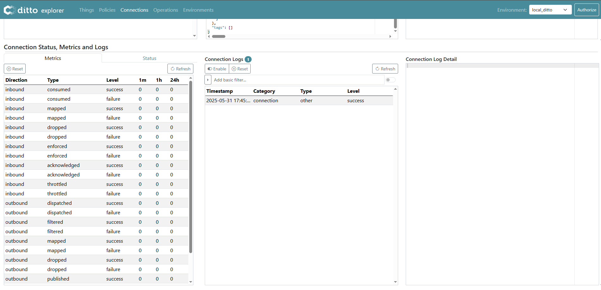
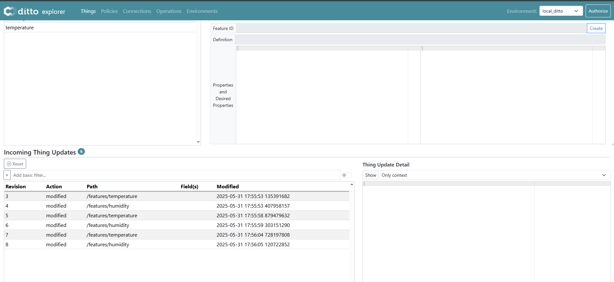

# Eclipse Ditto - Integrate a MQTT device

This project demonstrates a basic example of how to integrate a device with **[Eclipse Ditto](https://www.eclipse.org/ditto/)**. In this case, we connect a simulated MQTT-based sensor to Ditto to show how to define a Thing, establish MQTT communication, manage access via policies, and simulate real-time data streaming.

We simulate a simple **multisensor** that sends temperature and humidity data to Eclipse Ditto.

📷 For an overview of the platform's components, you can refer to the [Eclipse Ditto architecture diagram](https://www.eclipse.org/ditto/images/ditto-architecture.png). Ditto keeps a digital representation of this sensor and allows controlled interaction.


---

## Technical Requirements

### Docker

To keep things simple, all components will be run using [Docker](https://www.docker.com). **Docker** is a container
technology that allows different services to run in isolated environments.

- To install Docker on Linux, follow the instructions [here](https://docs.docker.com/install/).

### Docker Compose

**Docker Compose** is a tool for defining and running multi-container Docker applications using a `docker-compose.yml` file.

- Docker Compose is included by default with Docker Desktop (Windows & macOS).
- Linux users should install it following the guide [here](https://docs.docker.com/compose/install/).

Check your installed versions:

```bash
docker compose -v
docker version
```


---

### WSL (Windows Only)

If you’re using Windows, it's recommended to install the
[Windows Subsystem for Linux (WSL)](https://learn.microsoft.com/en-us/windows/wsl/install). It gives you access to a Linux-like command line that simplifies development and scripting.

---

## Getting Started

All the services that will be deployed are defined in the `docker-compose.yml` file.

First, clone this repository:

```bash
git clone https://github.com/piripopero/ditto-excellcity-summerschool.git
cd ditto-excellcity-summerschool
```

Before starting the services, make sure to create the external Docker network required by the setup (if it hasn’t been created previously):

```bash
docker network create ditto-deployment
```

Then start all required services:

```bash
docker compose up -d
```

This will launch:

You can also access Eclipse Ditto via its [web-based **UI**](http://localhost:8080/ui/), in addition to using its HTTP API. 


In this project, we’ll interact with the middleware both through the UI and programmatically using the API.

- Eclipse Ditto core services
- An MQTT broker (e.g., Mosquitto)
- A simulated MQTT sensor

Check if everything is running properly:
```bash
docker compose ps
```

---

## Step 1: Creating a Thing in Eclipse Ditto

We start by creating a **Thing** — the virtual representation of our physical multisensor.

Run the following command to register the Thing using the Ditto HTTP API:

```bash
curl -u ditto:ditto -X PUT -H 'Content-Type: application/json' -d '{
  "thingId": "my.test:octopus",
  "attributes": {
    "name": "multisensor",
    "type": "multisensor"
  },
  "features": {
    "temperature": {
      "properties": {
        "value": 100.67
      }
    },
    "humidity": {
      "properties": {
        "value": 120.9
      }
    }
  }
}' 'http://localhost:8080/api/2/things/my.test:octopus'
```

### What's happening?

- The request is sent to the Ditto **HTTP API** at `http://localhost:8080`.
- The Thing is identified by `thingId: my.test:octopus`.
- We're using **Basic Authentication** with the default credentials:  `Username: ditto`  `Password: ditto`

> 🔐 Learn more about [Ditto's Basic Authentication](https://eclipse.dev/ditto/basic-auth.html)> 📘 Full HTTP API documentation: [Ditto HTTP API](https://eclipse.dev/ditto/http-api-doc.html)

### Understanding the Thing Structure

In the request body:

- `attributes`: static info like name and type
- `features`: dynamic values like temperature and humidity

After creating the Thing, you can retrieve it using the following command:

```bash
curl -sS -u ditto:ditto --location 'http://localhost:8080/api/2/things/my.test:octopus' | jq  .
```

or via the UI:


---

## Step 2: Policies in Eclipse Ditto

Each Thing in Ditto must be associated with a **policy**. Policies define access control rules specifying who can read, write, or manage different parts of the Thing.

If no policy is explicitly set when creating a Thing, Ditto automatically assigns a **default policy**. You can view this in the UI under the **Policy** section. When no policy is explicitly defined, a default policy is automatically created by Ditto, which you can inspect through the UI in the 'Policies' tab.

> 📘 More info: [Basic Policy Management](https://eclipse.dev/ditto/basic-policy.html)

Now, , we will create a more advanced policy that grants different access levels to three users:

- **ditto**: full read/write access to all resources (Thing, Policy, and Messages)
- **demo1**: read-only access to the `temperature` feature
- **demo2**: read-only access to the `humidity` feature

The full policy definition is available in the file:

```
examples/policy_3consumers.json
```

You can create this policy either through the UI or using the HTTP API.

To create it via the API:

```bash
curl -u ditto:ditto -X PUT   -H 'Content-Type: application/json'   --data '@examples/policy_3consumers.json'   'http://localhost:8080/api/2/policies/my.test:policy_custom'

```
You can see the Policy created in the UI: (Please, load the policy by its ID **my.test:policy_custom** if it is not shown)


Once created, this policy can then be assigned to the Thing using an API call or via the UI.

To assign the policy to the Thing via API:

### Method : PUT request (to update the policyId associated to the existing Thing)

```bash
curl -u ditto:ditto -X PUT  -H 'Content-Type: application/json'  -d '"my.test:policy_custom"'   'http://localhost:8080/api/2/things/my.test:octopus/policyId'
```

This command updates the Thing to associate it with the new custom policy. You can retrieve again the Thing and check the updated policyId:
```bash
curl -sS -u ditto:ditto --location 'http://localhost:8080/api/2/things/my.test:octopus' | jq  .
```

📦 Response:
```json
{
  "thingId": "my.test:octopus",
  "policyId": "my.test:policy_custom",
  "attributes": {
    "name": "multisensor",
    "type": "multisensor"
  },
  "features": {
    "temperature": {
      "properties": {
        "value": 100.67
      }
    },
    "humidity": {
      "properties": {
        "value": 120.9
      }
    }
  }
}
```
### Verifying User Authorization with the new policy

You can check the available user in the file **nginx/nginx.htpasswd**
#### Commands to verify access:

##### 1. User: ditto (administrator)
   - Expected: Full access to the entire Thing

```
curl -sS -u ditto:ditto --location 'http://localhost:8080/api/2/things/my.test:octopus' | jq .
```

---

##### 2. User: demo1 (temperature-only access)
   - Expected: Only the `temperature` feature should be visible

```
curl -sS -u demo1:demo --location 'http://localhost:8080/api/2/things/my.test:octopus' | jq .
```

---

##### 3. User: demo2 (humidity-only access)
   - Expected: Only the `humidity` feature should be visible

```
curl -sS -u demo2:demo --location 'http://localhost:8080/api/2/things/my.test:octopus' | jq .
```

---
## Step 3: Managing Connections in Eclipse Ditto

A **connection** in Eclipse Ditto represents a communication channel between Ditto and an external system. It is used for exchanging messages—such as telemetry data or commands—using a specific transport protocol. Ditto supports both one-way (e.g., data ingestion) and two-way (e.g., command-response) communications. These capabilities depend on the selected protocol and the external system's support for such interactions.

In this example, our device sends data using the **MQTT protocol**, so we will configure a Ditto connection of type MQTT that points to the Mosquitto broker running at `localhost:1883`. Ideally, both sides would speak the **Ditto Protocol**, which defines a structured and efficient message format. However, many real-world IoT devices—especially legacy or "brownfield" devices—are unaware of Ditto and communicate using their own message structures.

Because of that, it becomes essential to define a custom **payload mapping**, which transforms incoming messages from the device's native format into the Ditto Protocol format. This allows Ditto to correctly interpret and mirror the state of the physical device in its digital twin representation.

Therefore, we will create an MQTT connection in Ditto and configure a mapping that transforms the sensor's MQTT-reported payload into a format compatible with Ditto's expectations.

### Creating the MQTT Connection via the Ditto UI

The configuration for this connection is already defined in the file:

```
examples/mqtt_connection.json
```

For easier visualization and testing, we will create the connection using the Eclipse Ditto UI:

1. Open the UI at [http://localhost:8080/ui](http://localhost:8080/ui)
2. Navigate to the **Connections** section in the left-hand menu
3. Click the **Create** button
4. Paste the full content of `examples/mqtt_connection.json` into the editor
5. Click **Create** again to establish the connection

This will activate the connection from Ditto to the local Mosquitto broker, allowing it to ingest MQTT messages and process them according to the defined mapping.

You can verify that the connection was successfully established by checking the **Connection Status**, **Metrics**, and **Logs** tabs in the Ditto UI under the created connection's detail view.
Click on Refresh if it is not appearing.



### Payload Mapping Script

The payload mapping is defined using a JavaScript function that transforms the incoming MQTT payload into a Ditto Protocol message. Below is a simple mapping function used to update a feature:

```javascript
function mapToDittoProtocolMsg(
    headers,
    textPayload,
    bytePayload,
    contentType
) {
    const jsonString = String.fromCharCode.apply(null, new Uint8Array(bytePayload));
    const jsonData = JSON.parse(jsonString);
    const thingId = jsonData.thingId.split(':');
    const topic_array = headers["mqtt.topic"].split("/");
    const thing_id_from_topic = topic_array[1];
    const attr_name_from_topic = topic_array[3];

    const value = {
        properties: {
            value: jsonData.value,
        }
    };

    return Ditto.buildDittoProtocolMsg(
        thingId[0], // your namespace
        thingId[1],
        'things', // we deal with a thing
        'twin', // we want to update the twin
        'commands', // create a command to update the twin
        'modify', // modify the twin
        '/features/' + attr_name_from_topic, // modify the feature indicated in the topic
        headers,
        value
    );
}
```

This script extracts the `thingId` and the feature name from the MQTT topic and payload, then constructs a Ditto Protocol message to update the corresponding feature in the digital twin.

---

## Step 4: Simulating Device Measurements via MQTT

To simulate a real device sending data, you can run the provided script:

```bash
sh scripts/simulate_mqtt_device_mqtt3.sh
```

This script continuously publishes random values to the MQTT broker, simulating a multisensor device. It sends messages to the following MQTT topics:

* `excellcity/my.test:octopus/attr/temperature`
* `excellcity/my.test:octopus/attr/humidity`

Each message published follows this simple JSON structure:

```json
{
  "value": <numeric_value>,
  "thingId": "my.test:octopus"
}
```

These messages emulate the temperature and humidity data being reported by the sensor. The topic structure and the payload format have been chosen specifically for this simulation scenario, but Ditto is fully flexible. Through mapping functions, you can adapt flexibily any topic structure and message format used by real-world devices to be compatible with the Ditto Protocol.

This simulation helps validate that the MQTT connection, mapping, and Thing updates are functioning as expected.

Once the simulation is running and messages are being published, you can observe the updates in real time through the Ditto UI:

* Navigate to the **Things** section
* Select the Thing `my.test:octopus`
* Open the **Incoming Thing Updates** tab

Here, you will see the changes to the `temperature` and `humidity` features as they are received from the MQTT messages. This confirms that the entire flow—from the simulated device sending MQTT data, through the Ditto connection and mapping, to the final digital twin update—is working correctly.


